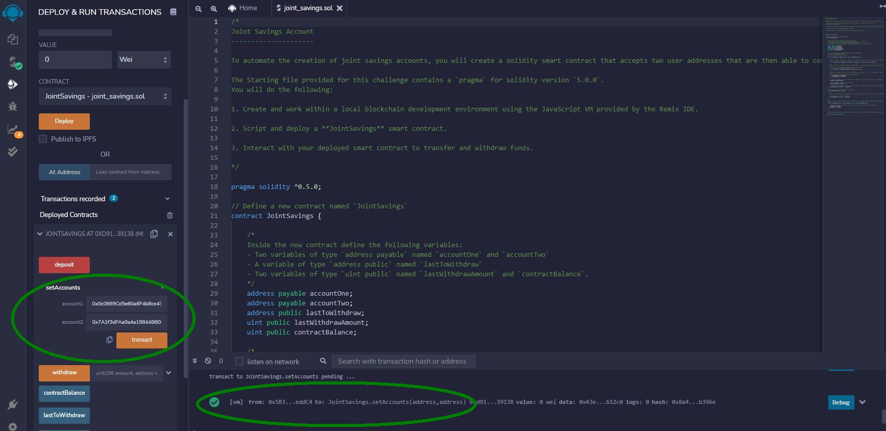
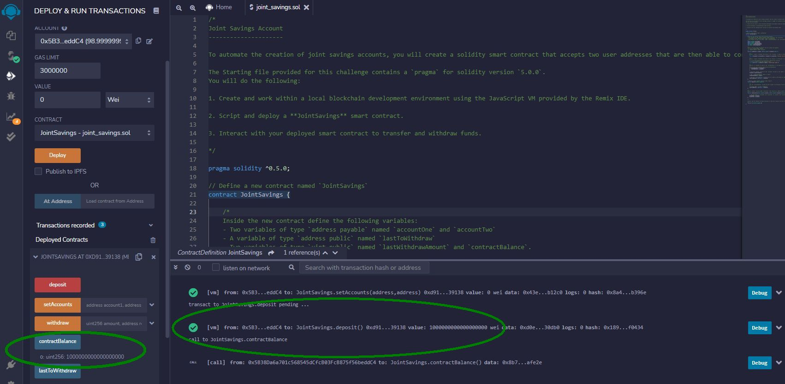
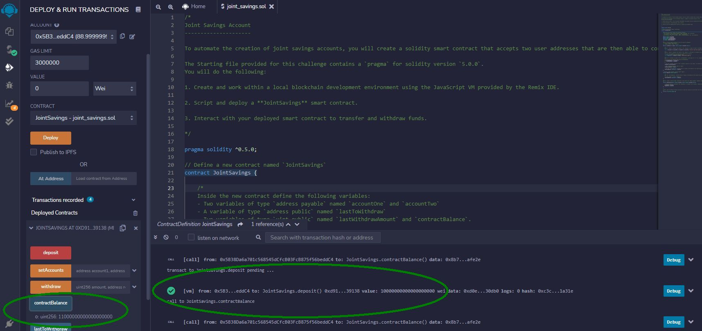
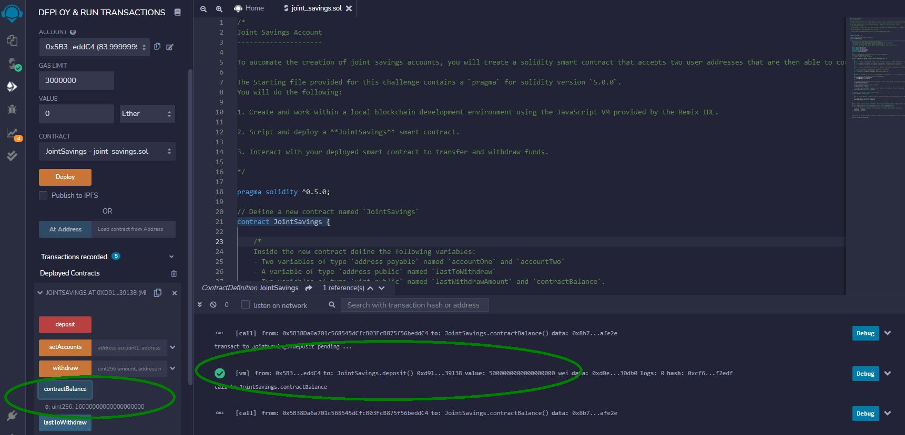
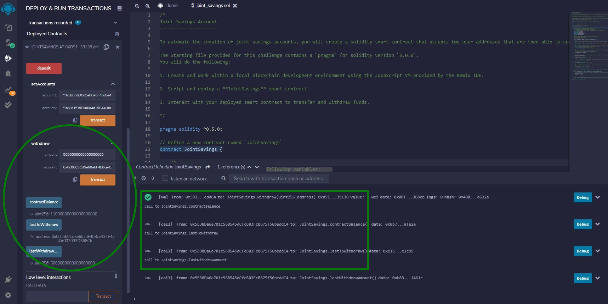
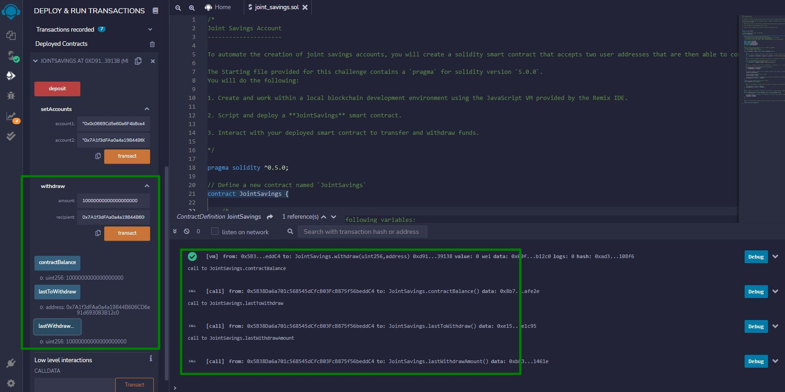

# joint-savings-solidity
### A Solidity smart contract that creates a joint savings account.

---
## Technologies
* Solidity 0.5.0
* remix.ethereum.org

---
## Summary
This joint-savings Solidity contract implements setter functions:
* setAccounts: define two account addresses
* deposit: Add funds to contract
* withdraw: Send funds to one of the defined account addresses
 
And getter functions:
* contractBalance: Display contract balance
* lastToWithdraw: Show which account last withdrew funds
* lastWithdraw: Show last amount withdrawn

---
## Screenshots

Set up two account addresses:

Add 1 ETH in wei to contract:

Add 10 ETH in wei to contract:

Add 5 ETH to contract:

Withdraw to account1:

Withdraw to account2:

---
## Contributors

[David Jonathan](https://www.linkedin.com/in/david-jonathan-1b9470/)

---
## License

Licensed under the [MIT License](https://github.com/tmbo/questionary/blob/master/LICENSE). Copyright 2022 David Jonathan